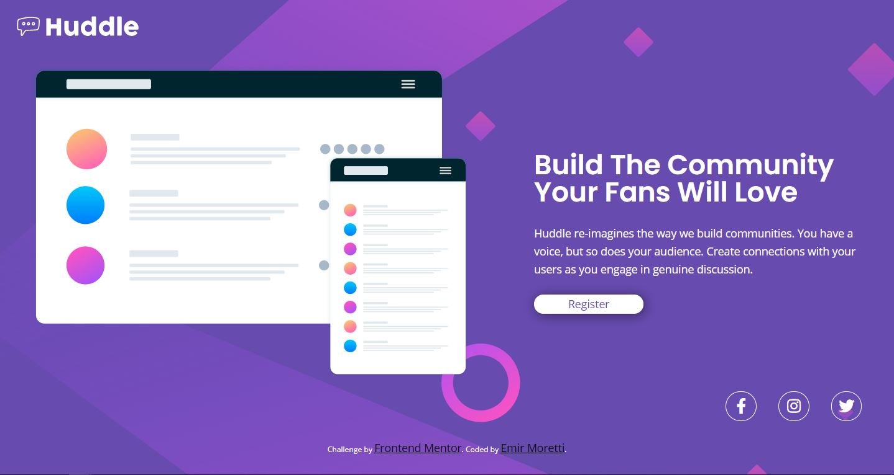

# Frontend Mentor - Huddle landing page with single introductory section solution

This is a solution to the [Huddle landing page with single introductory section challenge on Frontend Mentor](https://www.frontendmentor.io/challenges/huddle-landing-page-with-a-single-introductory-section-B_2Wvxgi0). Frontend Mentor challenges help you improve your coding skills by building realistic projects. 

## Table of contents

- [Overview](#overview)
  - [The challenge](#the-challenge)
  - [Screenshot](#screenshot)
  - [Links](#links)
  - [Built with](#built-with)
  - [What I learned](#what-i-learned)
  - [Continued development](#continued-development)
  - [Useful resources](#useful-resources)
- [Author](#author)
- [Acknowledgments](#acknowledgments)

## Overview
Hello everyone! I'm Emir and this is my first challenge from Frontendmentor
### The challenge

Users should be able to:

- View the optimal layout for the page depending on their device's screen size
- See hover states for all interactive elements on the page

### Screenshot



### Links

- Solution URL: [solution URL here](https://emirmoretti.github.io/landingPageFm/)

### Built with

- Semantic HTML5 markup
- CSS custom properties
- Flexbox
- Mobile-first workflow

### What I learned

With this project I learned some commands of Git//GitHub and how it works.

```
git init
```
```
git branch
```
```
git add .
```
```
git commmit -m
```
```
git push -u origin master
```
```
git merge
```

### Useful resources

- [Fontawesome](https://fontawesome.com/) - 
- [Font google](https://fonts.google.com/) -

## Author

- Frontend Mentor - [@emirmoretti](https://www.frontendmentor.io/profile/emirmoretti)
- Twitter - [@emirmoretti](https://www.twitter.com/emirmoretti)
- Instagram - [@emirmoretti](https://www.instagram.com/emirmoretti)
